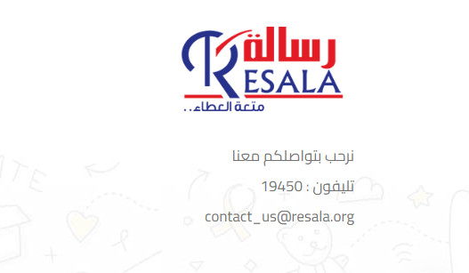
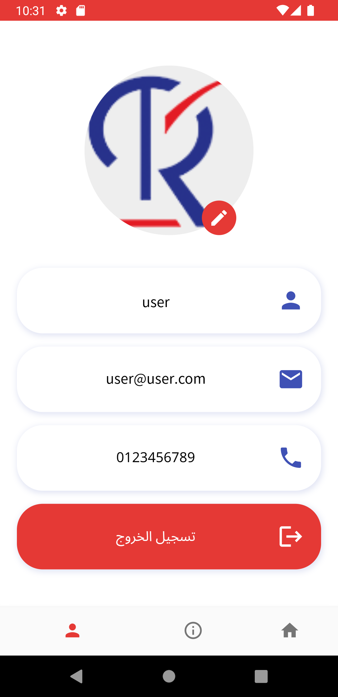

# Resala ORG 1.0.0

Application of Resala ORG ,Resala.org Developed using Flutter

    

<div align="center">

[](#)
[](https://github.com/abdalla3yash/resala/fork)
[](https://https://github.com/abdalla3yash/resala/issues)
[](#)

</div>


## 💻 Installation steps

- Updated to `Flutter 3.3.8` Now!
- Dart SDK `2.18.4` with Sound Null Safety!

Open CMD where you want to clone the project & run the following commands

```
git clone https://github.com/abdalla3yash/resala.git
cd resala-main
flutter packages get
flutter run
```

## 📱 Screen Shots

         


## 🔗 API Information

API Used: https://maghrabi.sha1.tech

## 🎯 Features Updated

✅ Activites

✅ TOP 5 

✅ About


## 🧑 Author

#### Abdalla Ayash
[](https://www.linkedin.com/in/abdalla-ayash)

You can also follow my GitHub Profile to stay updated about my latest projects:

[](https://github.com/abdalla3yash)

If you liked the repo then kindly support it by giving it a star ⭐!

Copyright (c) 2022 ABDALLA AYASH